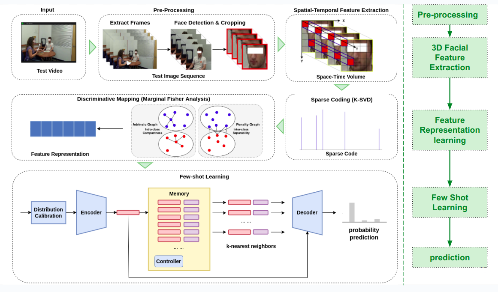

# Discriminative Few Shot Learning of Facial Dynamics in Interview Videos for Autism Trait Classification
This is the implementation of paper 'Zhang, Na, et al. "Discriminative few shot learning of facial dynamics in interview videos for autism trait classification." IEEE Transactions on Affective Computing (2022).'.

# Introduction
* Autism is a prevalent neurodevelopmental disorder characterized by impairments in social and communicative behaviors.
* Possible connections between autism and facial expression recognition have recently been studied in the literature. 
* In this paper, we developed a discriminative few shot learning method to analyze hour-long video data and exploring the fusion of facial dynamics for the trait classification of ASD. 
* Leveraging well-established computer vision tools from spatio-temporal feature extraction and marginal fisher analysis to few-shot learning and scene-level fusion, we have constructed a three-category system to classify an individual into Autism, Autism Spectrum, and Non-Spectrum.
* Data: ADOS interview videos (Autism Diagnostic Observation Schedule)

### Link: 
[[PDF]](https://ieeexplore.ieee.org/abstract/document/9785700)

# pipeline

This repository contains the implementation of:
* video pre-processing
* spatio-temporal feature extraction
* sparse coding
* marginal fisher analysis
* few-shot learning

